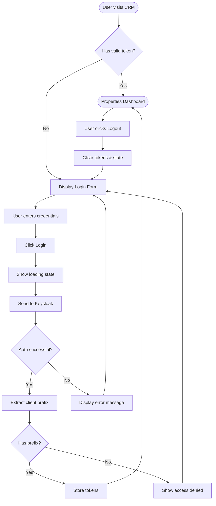

# UX Specification: Admin Login

**Platform**: Web (Desktop-first, responsive)

## User Flow



**Exit Path Behaviors:**
- **Browser Close**: Tokens persist in localStorage, user remains logged in on return
- **Session Expired**: Auto-redirect to login with "Session expired" message
- **Logout**: Clear all tokens, redirect to login page

## Interaction Model

### Core Actions

- **login**
  ```json
  {
    "trigger": "User clicks Login button or presses Enter",
    "feedback": "Button shows spinner, inputs disabled",
    "success": "Redirect to /properties dashboard",
    "error": "Inline error message, inputs re-enabled, password cleared"
  }
  ```

- **logout**
  ```json
  {
    "trigger": "User clicks Logout in header",
    "feedback": "Immediate redirect, no confirmation",
    "success": "Return to login page, tokens cleared",
    "error": "Force clear local state, redirect anyway"
  }
  ```

### States & Transitions

```json
{
  "unauthenticated": "No valid token, show login form",
  "authenticating": "Credentials submitted, waiting for Keycloak response",
  "authenticated": "Valid token, can access dashboard",
  "session_expired": "Token expired, prompt re-login",
  "error": "Auth failed, show error message"
}
```

## Quantified UX Elements

| Element | Formula / Source Reference |
|---------|----------------------------|
| Token refresh | `expires_in - 60 seconds` (refresh 1 min before expiry) |
| Session timeout display | `token_expiry - current_time` |
| Loading spinner timeout | `10 seconds max` before showing error |

## Platform-Specific Patterns

### Web
- **Responsive**: Centered login card, max-width 400px, full-width on mobile
- **Keyboard**: Tab between fields, Enter submits form
- **Browser**: Remember username via autocomplete="username"

## Accessibility Standards

- **Screen Readers**: ARIA role="form" on login container, aria-live="polite" for errors
- **Navigation**: Tab order: username → password → login button, Enter submits
- **Visual**: Contrast ratio 4.5:1, error states use icon + color + text
- **Touch Targets**: Minimum 44x44px for login button

## Error Presentation

```json
{
  "network_failure": {
    "visual_indicator": "Red banner above form",
    "message_template": "Unable to connect. Please check your connection.",
    "action_options": "Retry button",
    "auto_recovery": "None"
  },
  "validation_error": {
    "visual_indicator": "Red text below form, red border on fields",
    "message_template": "Invalid username or password.",
    "action_options": "Password field cleared, focused",
    "auto_recovery": "Error clears on new input"
  },
  "timeout": {
    "visual_indicator": "Red banner above form",
    "message_template": "Request timed out. Please try again.",
    "action_options": "Retry button",
    "auto_recovery": "None"
  },
  "permission_denied": {
    "visual_indicator": "Red banner above form",
    "message_template": "Access denied. Contact your administrator.",
    "action_options": "None",
    "auto_recovery": "None"
  }
}
```
