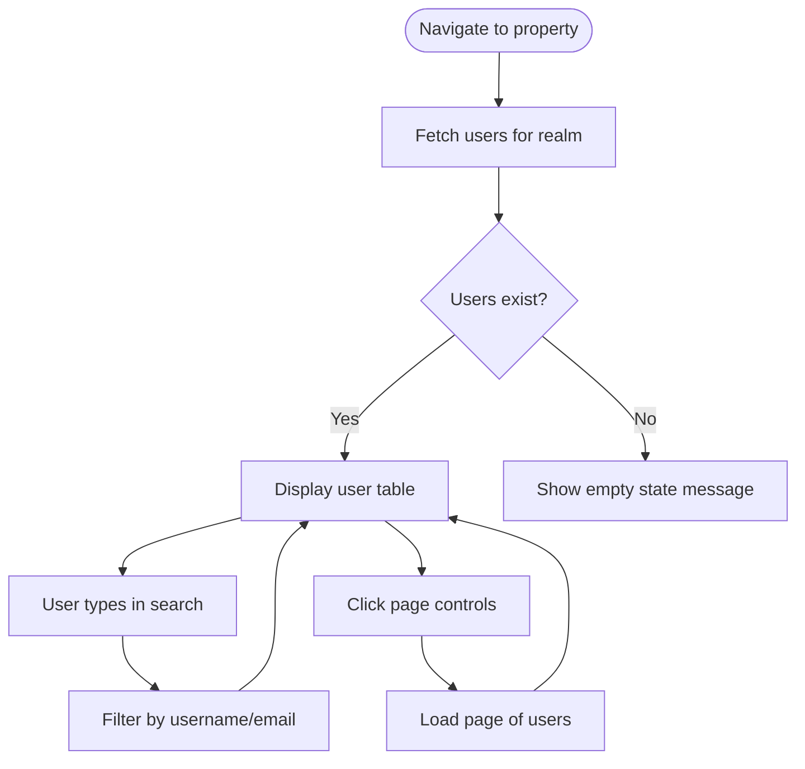

# UX Specification: Manage Users

**Platform**: Web (Desktop-first, responsive)

## User Flow



**Exit Path Behaviors:**
- **Back to properties**: Navigate to /properties
- **Logout**: Clear session, return to login

## Interaction Model

### Core Actions

- **search_users**
  ```json
  {
    "trigger": "User types in search field (debounced 300ms)",
    "feedback": "Table filters as user types",
    "success": "Matching users displayed",
    "error": "None (empty results shown)"
  }
  ```

- **change_page**
  ```json
  {
    "trigger": "User clicks pagination controls",
    "feedback": "Loading indicator on table",
    "success": "New page of users displayed",
    "error": "Toast with retry option"
  }
  ```

### States & Transitions

```json
{
  "loading": "Fetching users from Keycloak",
  "ready": "Users displayed in table",
  "searching": "Filtering results",
  "empty": "No users found",
  "error": "Failed to load users"
}
```

## Quantified UX Elements

| Element | Formula / Source Reference |
|---------|----------------------------|
| Users per page | 20 |
| Search debounce | 300ms |
| Last login format | Relative time (e.g., "2 hours ago") |

## Accessibility Standards

- **Screen Readers**: Table with proper headers, aria-sort on sortable columns
- **Navigation**: Tab through search, table rows, pagination
- **Visual**: Contrast 4.5:1, disabled badge clearly distinguishable

## Error Presentation

```json
{
  "network_failure": {
    "visual_indicator": "Error banner above table",
    "message_template": "Unable to load users. Please try again.",
    "action_options": "Retry button",
    "auto_recovery": "None"
  },
  "empty_state": {
    "visual_indicator": "Centered message in table area",
    "message_template": "No users yet. Users are added via the Request Access workflow.",
    "action_options": "None",
    "auto_recovery": "None"
  }
}
```
