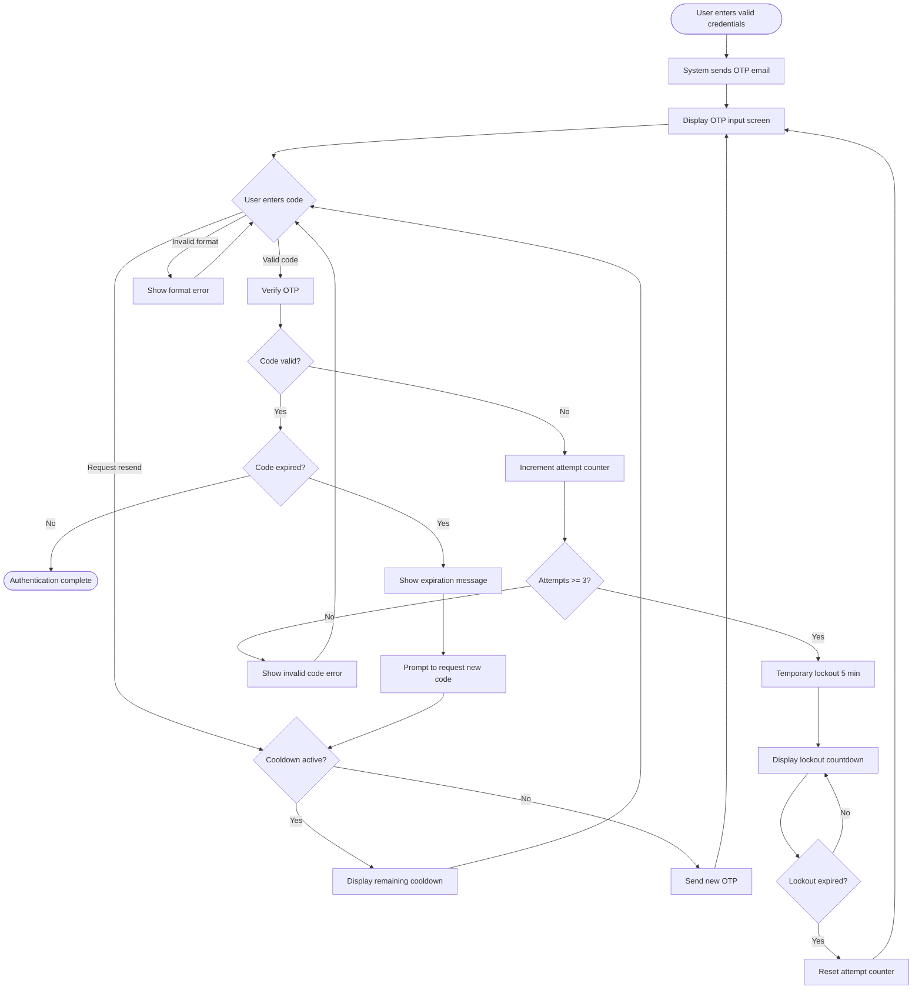

# UX Specification: MFA Email OTP

**Platform**: Web (Desktop-first, responsive)

## User Flow



**Exit Path Behaviors:**
- **Cancel/Back**: Clears OTP session state, returns to login form, any pending OTP invalidated server-side
- **Browser Close**: OTP remains valid until expiration (5 min), session state cleared on next login attempt
- **Timeout (idle)**: After code expiration, UI prompts for new code, old code invalidated

## Interaction Model

### Core Actions

- **submit_otp**
  ```json
  {
    "trigger": "User clicks Verify button or presses Enter after entering 6 digits",
    "feedback": "Button shows loading spinner, input disabled",
    "success": "Redirect to application with success toast",
    "error": "Inline error below input, input cleared, focus returns to input"
  }
  ```

- **resend_code**
  ```json
  {
    "trigger": "User clicks Resend Code link/button",
    "feedback": "Button disabled, shows sending state, cooldown timer starts",
    "success": "Toast: 'New code sent to your email', timer shows 60s cooldown",
    "error": "Toast: 'Failed to send code. Please try again.', button re-enabled"
  }
  ```

- **input_digit**
  ```json
  {
    "trigger": "User types digit in OTP field",
    "feedback": "Digit appears, auto-advance to next position (if segmented input)",
    "success": "When 6 digits entered, auto-submit or enable Verify button",
    "error": "Non-digit characters rejected silently"
  }
  ```

### States & Transitions

```json
{
  "awaiting_input": "OTP screen displayed, input focused, waiting for user to enter code",
  "validating": "Code submitted, loading spinner active, input disabled",
  "resending": "Resend requested, waiting for email delivery confirmation",
  "cooldown": "Resend disabled, countdown timer visible, user can still enter code",
  "locked_out": "Too many failed attempts, all inputs disabled, lockout countdown visible",
  "expired": "Code expired, prompt to request new code displayed",
  "success": "Valid code accepted, redirecting to application"
}
```

## Quantified UX Elements

| Element | Formula / Source Reference |
|---------|----------------------------|
| OTP expiration countdown | `OTP_EXPIRY_SECONDS - elapsed_seconds` (300s - elapsed) |
| Resend cooldown timer | `RESEND_COOLDOWN_SECONDS - elapsed_seconds` (60s - elapsed) |
| Lockout countdown | `LOCKOUT_DURATION_SECONDS - elapsed_seconds` (300s - elapsed) |
| Remaining attempts display | `MAX_OTP_ATTEMPTS - current_attempts` (3 - attempts) |

## Platform-Specific Patterns

### Web
- **Responsive**: Single-column centered layout, max-width 400px, scales down for mobile viewports (320px min)
- **Keyboard**: Tab navigates between input and buttons, Enter submits, Escape returns to login
- **Browser**: Paste support for OTP from clipboard, autocomplete="one-time-code" for mobile autofill

## Accessibility Standards

- **Screen Readers**: ARIA role="form" on OTP container, aria-live="polite" for countdown timers, aria-live="assertive" for error messages, aria-describedby linking input to instructions
- **Navigation**: Tab order: OTP input → Verify button → Resend link → Cancel link, Enter submits form, Escape cancels
- **Visual**: Contrast ratio 4.5:1 minimum for all text, error states use icon + color + text (not color alone)
- **Touch Targets**: Minimum 44x44px for Verify button and Resend link

## Error Presentation

```json
{
  "network_failure": {
    "visual_indicator": "Toast notification at top of screen with red background and warning icon",
    "message_template": "Unable to verify code. Please check your connection and try again.",
    "action_options": "Retry button in toast, code input remains editable",
    "auto_recovery": "Toast auto-dismisses after 5s, user can retry immediately"
  },
  "validation_error": {
    "visual_indicator": "Inline red text below OTP input, input border turns red",
    "message_template": "Invalid code. {remaining_attempts} attempts remaining.",
    "action_options": "Input cleared and focused for retry",
    "auto_recovery": "Error clears when user starts typing new code"
  },
  "timeout": {
    "visual_indicator": "OTP input grayed out, overlay message in center of form",
    "message_template": "This code has expired. Please request a new one.",
    "action_options": "Resend Code button prominently displayed",
    "auto_recovery": "None - requires user action to request new code"
  },
  "permission_denied": {
    "visual_indicator": "Full-screen overlay with lock icon, form completely disabled",
    "message_template": "Account temporarily locked. Please wait {lockout_remaining} before trying again.",
    "action_options": "Countdown timer only, no actions available until lockout expires",
    "auto_recovery": "Form re-enables automatically when lockout expires, attempt counter reset"
  }
}
```

---
