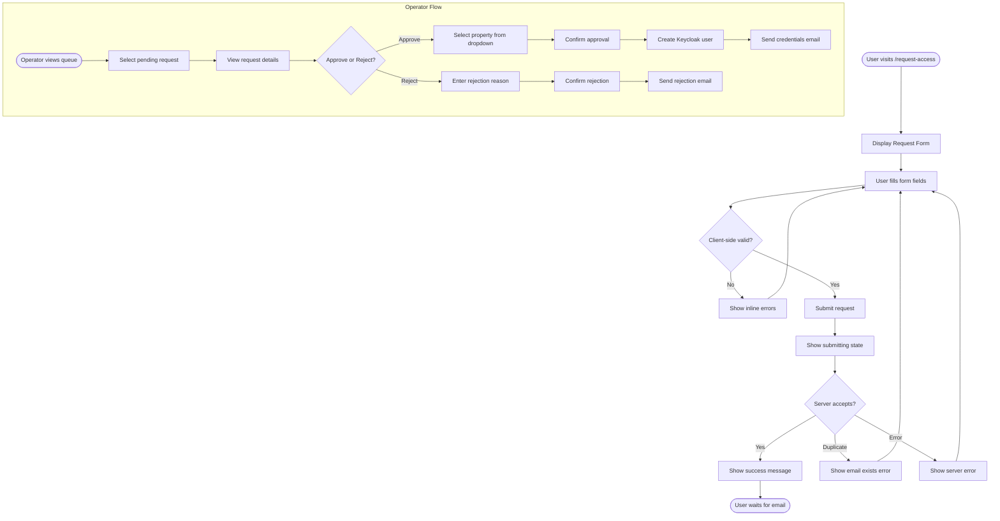

# UX Specification: Request Access

**Platform**: Web (Desktop-first, responsive)

## User Flow



**Exit Path Behaviors:**
- **Cancel (public form)**: Form cleared, no data saved
- **Close modal (operator)**: No changes saved, request remains pending

## Interaction Model

### Core Actions

- **submit_request**
  ```json
  {
    "trigger": "User clicks Submit Request button",
    "feedback": "Button shows spinner, form disabled",
    "success": "Success message with check icon, form hidden",
    "error": "Inline error below form, form re-enabled"
  }
  ```

- **approve_request**
  ```json
  {
    "trigger": "Operator clicks Approve in modal",
    "feedback": "Button shows spinner",
    "success": "Toast: 'User created and notified', request removed from queue",
    "error": "Toast: 'Failed to create user', modal stays open"
  }
  ```

- **reject_request**
  ```json
  {
    "trigger": "Operator clicks Reject in modal",
    "feedback": "Button shows spinner",
    "success": "Toast: 'Request rejected', request removed from queue",
    "error": "Toast: 'Failed to reject', modal stays open"
  }
  ```

### States & Transitions

```json
{
  "form_idle": "Empty form ready for input",
  "form_filling": "User entering data",
  "form_submitting": "Request being sent to server",
  "form_success": "Request submitted successfully",
  "form_error": "Submission failed",
  "queue_loading": "Loading pending requests",
  "queue_ready": "Requests displayed in table",
  "reviewing": "Operator viewing request details modal",
  "processing": "Approve/reject in progress"
}
```

## Quantified UX Elements

| Element | Formula / Source Reference |
|---------|----------------------------|
| Form fields | 6 required + 1 optional |
| Rejection reason min length | 10 characters |
| Queue refresh interval | 30 seconds |

## Platform-Specific Patterns

### Web
- **Responsive**: Form max-width 500px centered, queue full-width table
- **Keyboard**: Tab through fields, Enter submits
- **Browser**: Form autocomplete for name/email/phone fields

## Accessibility Standards

- **Screen Readers**: ARIA role="form", aria-required on required fields, aria-describedby for errors
- **Navigation**: Tab order follows visual order, Enter submits form
- **Visual**: Contrast ratio 4.5:1, required fields marked with asterisk
- **Touch Targets**: Minimum 44x44px for buttons

## Error Presentation

```json
{
  "network_failure": {
    "visual_indicator": "Red banner above form",
    "message_template": "Unable to submit. Please check your connection.",
    "action_options": "Retry button",
    "auto_recovery": "None"
  },
  "validation_error": {
    "visual_indicator": "Red text below each invalid field",
    "message_template": "[Field] is required / Invalid [field] format",
    "action_options": "Focus first invalid field",
    "auto_recovery": "Error clears when field corrected"
  },
  "duplicate_email": {
    "visual_indicator": "Red text below email field",
    "message_template": "This email is already registered.",
    "action_options": "None",
    "auto_recovery": "Error clears when email changed"
  },
  "server_error": {
    "visual_indicator": "Red banner above form",
    "message_template": "Server error. Please try again later.",
    "action_options": "Retry button",
    "auto_recovery": "None"
  }
}
```
