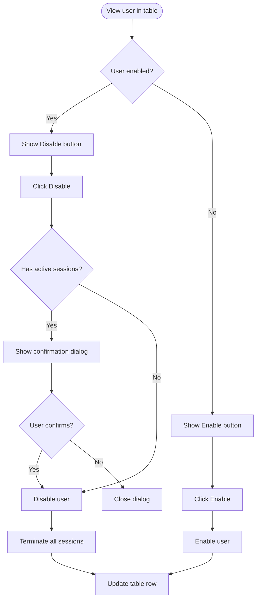

# UX Specification: User Status

**Platform**: Web (Desktop-first, responsive)

## User Flow



**Exit Path Behaviors:**
- **Cancel confirmation**: Dialog closes, no changes
- **Escape key**: Same as cancel

## Interaction Model

### Core Actions

- **toggle_status**
  ```json
  {
    "trigger": "Click Enable/Disable button in user row",
    "feedback": "Button shows loading spinner",
    "success": "Row updates, toast confirms action",
    "error": "Toast with error, row reverts"
  }
  ```

### States & Transitions

```json
{
  "enabled": "User can authenticate",
  "disabled": "User cannot authenticate, shown grayed",
  "toggling": "Status change in progress"
}
```

## Quantified UX Elements

| Element | Formula / Source Reference |
|---------|----------------------------|
| Active sessions count | From Keycloak sessions API |

## Accessibility Standards

- **Screen Readers**: Button announces current state and action
- **Navigation**: Tab to toggle button, Enter activates
- **Visual**: Disabled row clearly grayed out (opacity 0.6)

## Error Presentation

```json
{
  "network_failure": {
    "visual_indicator": "Toast notification",
    "message_template": "Failed to update user status. Please try again.",
    "action_options": "Retry in toast",
    "auto_recovery": "Row reverts to previous state"
  },
  "self_disable": {
    "visual_indicator": "Warning toast",
    "message_template": "You cannot disable your own account.",
    "action_options": "None",
    "auto_recovery": "None"
  }
}
```
