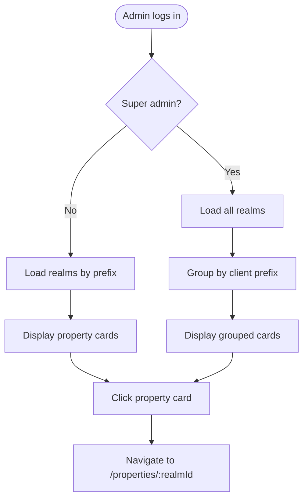

# UX Specification: View Properties

**Platform**: Web (Desktop-first, responsive)

## User Flow



**Exit Path Behaviors:**
- **Logout**: Return to login page
- **Session expired**: Redirect to login with message

## Interaction Model

### Core Actions

- **select_property**
  ```json
  {
    "trigger": "User clicks property card",
    "feedback": "Card shows hover state, then navigates",
    "success": "Navigate to property detail page",
    "error": "Toast if realm unavailable"
  }
  ```

### States & Transitions

```json
{
  "loading": "Fetching realms from Keycloak",
  "ready": "Properties displayed in grid",
  "empty": "No properties found for client",
  "error": "Failed to load properties"
}
```

## Quantified UX Elements

| Element | Formula / Source Reference |
|---------|----------------------------|
| User count per card | From Keycloak realm user count API |
| Cards per row | 3 on desktop, 2 on tablet, 1 on mobile |

## Platform-Specific Patterns

### Web
- **Responsive**: Grid layout 3/2/1 columns by breakpoint
- **Keyboard**: Tab between cards, Enter selects
- **Browser**: URL updates to /properties on navigation

## Accessibility Standards

- **Screen Readers**: Cards as role="article", aria-label with property name
- **Navigation**: Tab through cards, Enter activates
- **Visual**: Contrast 4.5:1, disabled state clearly visible
- **Touch Targets**: Entire card clickable, min 100x80px

## Error Presentation

```json
{
  "network_failure": {
    "visual_indicator": "Error state with retry button",
    "message_template": "Unable to load properties. Please try again.",
    "action_options": "Retry button",
    "auto_recovery": "None"
  },
  "empty_state": {
    "visual_indicator": "Centered message with icon",
    "message_template": "No properties found for your organization.",
    "action_options": "Contact admin link",
    "auto_recovery": "None"
  }
}
```
